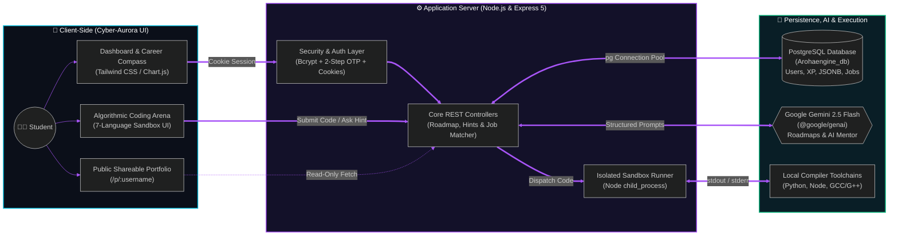

<div align="center">

# AROHA


### Pinpoint exact technical deficiencies, bridge skill gaps, and master software engineering.<br/>Your career. Your roadmap.

</div>

---

<details>
<summary><h1>Table of Contents</h1></summary>

- [Architecture Diagram](#architecture-diagram)
- [The Problem](#the-problem)
- [Our Solution](#our-solution)
- [Key Features](#key-features)
  - [1. Career Compass & Dynamic Roadmaps](#1-career-compass--dynamic-roadmaps)
  - [2. Dual-Mode AI Mentor](#2-dual-mode-ai-mentor)
  - [3. Multi-Language Code Sandbox](#3-multi-language-code-sandbox)
  - [4. Live Job Matching & Shareable Portfolios](#4-live-job-matching--shareable-portfolios)
- [Tech Stack](#tech-stack)
- [Installation & Setup Guide](#installation--setup-guide)
  - [1. Clone the Repository](#1-clone-the-repository)
  - [2. Install Dependencies](#2-install-dependencies)
  - [3. Configure Environment Variables](#3-configure-environment-variables)
  - [4. Run the Application](#4-run-the-application)
- [License](#license)

</details>

---

# Architecture Diagram



---

## The Problem

Computer science students often get stuck in "tutorial hell"—watching endless videos without knowing which exact skills they lack for their target career role, how to debug their own code without looking up full spoilers, or how ready they actually are for real-world industry jobs.

## Our Solution

**AROHA** bridges the gap between learning and hiring. By combining baseline skill diagnostics, generative AI curriculum planning, a live multi-language code execution sandbox, and SQL-backed job matching, AROHA turns passive studying into measurable career readiness.

---

## Key Features

### 1. Career Compass & Dynamic Roadmaps
* **Adaptive Curricula:** Custom week-by-week learning roadmaps dynamically generated for your target career role (Frontend, Backend, Embedded Systems, Data Analysis, DevOps) powered by **Google Gemini 2.5 Flash**.
* **Cyber-Aurora Telemetry:** High-saturation obsidian canvas (`#050711`), frosted glassmorphism, circular readiness gauges, and Chart.js language proficiency visualizations.

### 2. Dual-Mode AI Mentor
* **Conceptual Guidance:** High-level starting intuitions, data structures, and algorithmic strategies when your editor is blank without giving away code spoilers.
* **Targeted Diagnostics:** Pinpoints logic flaws, edge cases, and runtime exceptions in student submissions.

### 3. Multi-Language Code Sandbox
* **Algorithmic Arenas & Micro-Quests:** 21 hands-on coding challenges across 7 core programming languages (C++, C, Python, Java, JavaScript, HTML, and CSS).
* **Isolated Verification:** Run and test solutions in isolated environments with `stdout`, `stderr`, and strict whitespace normalization verification.

### 4. Live Job Matching & Shareable Portfolios
* **Live Industry Job Matching:** Real-time compatibility matching against active software engineering roles stored in PostgreSQL.
* **Global Peer Leaderboard:** Live student rankings based on accumulated XP, quest completions, and verified skill competencies.
* **Public Shareable Portfolios:** Unique read-only student portfolio showcase (`/p/:username`) highlighting role readiness, completed arenas, and verified languages.

---

## Tech Stack

* **Backend:** Node.js, Express 5, Google GenAI SDK (`@google/genai`)
* **Database:** PostgreSQL with connection pooling (`pg`)
* **Security & Auth:** Bcrypt password hashing, 2-step OTP recovery, HTTP-only cookie sessions
* **Frontend:** Modern Vanilla JS, Tailwind CSS, Chart.js, FontAwesome
* **Code Execution:** Local sandbox execution engine supporting multi-compiler toolchains (`child_process`)

---

## Installation & Setup Guide

### 1. Clone the Repository

```bash
git clone [https://github.com/aryanatul2008-ship-it/Aroha.git](https://github.com/aryanatul2008-ship-it/Aroha.git)
cd Aroha
```

### 2. Install Dependencies

```bash
npm install
```

### 3. Configure Environment Variables

Copy `.env.example` to `.env`:

```bash
cp .env.example .env
```

Update `.env` with your PostgreSQL database credentials and Google Gemini API key:

```env
PORT=3000
DB_USER=postgres
DB_HOST=localhost
DB_NAME=Arohaengine_db
DB_PASSWORD=your_password
DB_PORT=5432
GEMINI_API_KEY=your_gemini_api_key
```

### 4. Run the Application

```bash
npm run dev
# or: node server.js
```

Open `http://localhost:3000` in your browser.

---

## License

ISC License © 2026 AROHA Platform.
